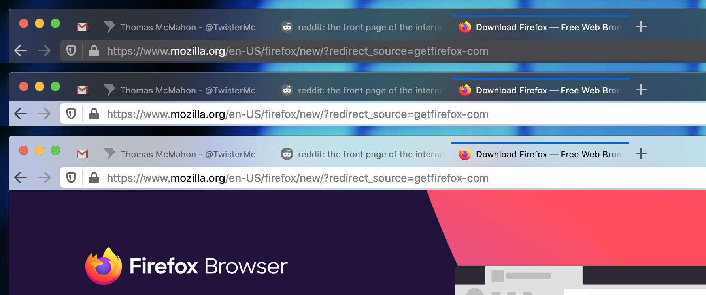

# Moz-Mac Firefox Theme
## by Thomas McMahon / @twistermc / twistermc.com
Translucent Mac Firefox Theme

Info: https://www.twistermc.com/44353/moz-mac-a-translucent-firefox-theme/

v1.0 - Initial Release

### Installation
1. Go to `about:support` in Firefox.
2. Find the Profile Folder and Show in Finder
3. Open the `chrome` directory. If it doesn't exist, create it.
4. Create a folder called `moz-mac`
5. Download `https://raw.githubusercontent.com/TwisterMc/moz-mac/master/userChrome.css` and save it the `moz-mac` folder.
6. Backup out one directory and open the `userChrome.css` file (create it if it doesn't exist) and add this line at the beginning of the file. `@import "moz-mac/userChrome.css";`
7. Restart Firefox.
8. Change your Firefox theme to Light, Dark or Default.
